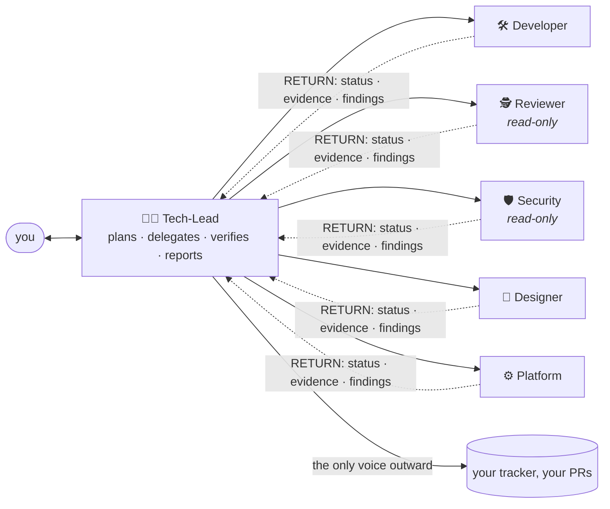

<h1 align="center">e-colleagues</h1>

<p align="center">
A team of AI personas for your coding agent: one tech-lead that plans and reports, specialists it delegates to,<br/>
and a reviewer that cannot edit your files. Installed once. Rendered for Codex CLI, Claude Code, opencode and Antigravity.
</p>

<p align="center">
<a href="https://github.com/gnuruzzi/e-colleagues/actions/workflows/check.yml"></a>


<a href="LICENSE"></a>
</p>

---

Ask the tech-lead to review a change. It delegates to the reviewer, checks the evidence itself, and comes back with a verdict and a question for you. Unedited, Claude Code 2.1.284, headless:

```text
> Review the change in the last commit for correctness before we merge it.

👨‍💻 Tech-Lead: Both spot-checks confirm the Reviewer's evidence. Here's the report.

Verdict: do not merge yet — REQUEST CHANGES
Reviewed: commit fbc32cd "add discount helper". Reviewer: 🕵️ e-colleagues:reviewer,
read-only, no files touched.

Blocking — src/pricing.py:5 returns a float, never an int
  `price_cents - price_cents * percent / 100` uses true division. I reproduced the probe:
    (1000, 10) -> 900.0               float
    (999, 33)  -> 669.3299999999999   float
  The shipped test passes only because 900 == 900.0 is True in Python.
  The fix needs a decision from you: which rounding applies to fractional cents?

Recommended next step: tell me the rounding policy. I'll brief the Developer to fix the
arithmetic and extend the tests, and send it back through the Reviewer before I call it done.
```

## What you get

- **One voice, a whole team behind it.** You talk to the tech-lead. It plans, delegates each piece with a brief, verifies the result against acceptance criteria, and reports once, with evidence. Specialists return findings; only the tech-lead speaks to you or posts anywhere.
- **Roles that hold.** The reviewer and the security persona have no edit tools on any host. On Codex the sandbox makes that a filesystem guarantee; elsewhere it is the tool list, and the table below says which is which.
- **Your rules, in your repository.** `ec-init` interviews you once and writes the operating contract as one managed block in `AGENTS.md`. `ec-onboard` has each persona learn its angle of the project, indexing what you already document before writing anything. Every knowledge file records the commit it came from, so going stale is a `git diff`.

## How it works



| persona | does | edits files |
|---|---|---|
| 👨‍💻 **Tech-Lead** | plans, delegates, verifies, reports; owns `AGENTS.md` | yes |
| 🛠️ **Developer** | implements a specified change and writes its tests | yes |
| 🕵️ **Reviewer** | reads the change as an adversary: edge cases, races, coverage | **no** |
| 🛡️ **Security** | audits for vulnerabilities, secrets handling, dependency and CVE exposure, attack surface | **no** |
| 🎨 **Designer** | user-interface and user-experience work, implementation-ready specs | yes |
| ⚙️ **Platform** | CI/CD, deployment, infrastructure and observability | yes |

The six are a catalog, not a fixed cast. A project uses the subset it needs, `library` drops the designer and `minimal` keeps three, and adding a persona of your own is one YAML file plus a re-render ([design §16](docs/design.md)). Everything is authored once in `personas/` and rendered into each host's dialect; a drift gate fails when the two disagree.

## Get started

Pick your tool. Each block is complete: install once per machine, start the tech-lead in a project, run the three onboarding skills, make your first request.

<details>
<summary><b>Claude Code</b></summary>

```bash
git clone https://github.com/gnuruzzi/e-colleagues ~/e-colleagues && cd ~/e-colleagues
claude plugin marketplace add "$PWD"
claude plugin install e-colleagues@e-colleagues

cd ~/your-project && claude --agent tech-lead
```

In the session:

```text
/e-colleagues:ec-init        the contract: roster, tracker, who may merge → one block in AGENTS.md
/e-colleagues:ec-onboard     each persona learns its angle of the project
/e-colleagues:ec-status      later: which of that knowledge went stale
Review the change in the last commit before we merge it.
```

Delegation uses the qualified name, `e-colleagues:reviewer`. Both install lines are needed even for a repository whose own settings declare this marketplace: trust registers it but does not load the plugin, silently (E23 addendum).

</details>

<details>
<summary><b>Codex CLI</b></summary>

```bash
git clone https://github.com/gnuruzzi/e-colleagues ~/e-colleagues && cd ~/e-colleagues
codex plugin marketplace add "$PWD"
codex plugin add e-colleagues@e-colleagues
python3 skills/ec-init/scripts/bootstrap.py --scope user --write

cd ~/your-project && codex --profile e-colleagues
```

In the session:

```text
$ec-init
$ec-onboard
$ec-status
Review the change in the last commit before we merge it.
```

The plugin carries the skills; the personas are written to `~/.codex/` as real files, because a symlinked role is found and then fails at spawn (E5). The reviewer runs under `sandbox_mode = "read-only"`: the project's tests run, and nothing can be written, `/tmp` included.

</details>

<details>
<summary><b>opencode</b></summary>

```bash
git clone https://github.com/gnuruzzi/e-colleagues ~/e-colleagues && cd ~/e-colleagues
python3 skills/ec-init/scripts/bootstrap.py --scope user --write

cd ~/your-project
opencode run --agent tech-lead "use the ec-init skill"
opencode run --agent tech-lead "use the ec-onboard skill"
opencode run --agent tech-lead "Review the change in the last commit before we merge it."
```

In the TUI, Shift+Tab cycles to the tech-lead and `@` lists the skills and the specialists. opencode has no plugin route for agents (E25), so the agents and the four skills install as real files under `~/.config/opencode/`; your global config is never written.

</details>

<details>
<summary><b>Antigravity</b></summary>

```bash
agy plugin install https://github.com/gnuruzzi/e-colleagues

cd ~/your-project && agy --agent tech-lead
```

In the session:

```text
/ec-init
/ec-onboard
/ec-status
Audit the CI pipeline and tell me what a new contributor would trip over.
```

Only a global install delivers agents, so the roster is per machine; a re-install merges rather than replaces, so uninstall first when it shrinks (E8).

</details>

To update, `git pull` in the clone and re-run your tool's install lines. `bootstrap.py --scope user --check` reports what is out of date.

## What to ask it

The tech-lead handles anything you would ask a session, and routes the parts that need a specialist:

- *"Review the change in the last commit before we merge it."* The reviewer reads it as an adversary and returns findings with evidence; the tech-lead verifies and reports.
- *"Plan the rename of the billing module and delegate the pieces."* A plan for your approval, then developer work in slices, each reviewed before it is called done.
- *"Is this endpoint safe to expose?"* The security persona, read-only, on vulnerabilities, secrets handling and attack surface.
- *"Audit the CI pipeline and tell me what a new contributor would trip over."* The platform persona, from the workflow files up.

Every delegation ends in a RETURN block the tech-lead relays: status, what changed, evidence (the commands run and their exit codes), findings, risks, follow-ups, and the questions only you can decide. "Done" means reviewed.

## What is guaranteed, and what is only asked

A guarantee that is really a request is worth naming.

| host | floor | re-verified at | tech-lead is primary by | "cannot edit" is enforced by |
|---|---|---|---|---|
| Codex CLI | 0.153.4 | 0.154.0 | `developer_instructions` (prose) | **the sandbox**: the one filesystem guarantee |
| Claude Code | 2.1.263 | 2.1.284 | `--agent` (mechanical) | the tool list; the shell can still write |
| opencode | 1.18.29 | 2.0.18 | `default_agent` (mechanical) | permissions; the shell narrowed by patterns |
| Antigravity | agy 1.1.27 | agy 1.2.10, desktop 2.17.0 | `mainAgent` (mechanical) | the tool list; `run_command` can still write |

- Codex's read-only sandbox blocks **every** write, so a test suite that writes anything needs an explicit override.
- Antigravity and opencode have no per-project roster from this package; both install per machine.
- `AGENTS.md` never reaches an Antigravity agent, so its personas carry the contract in their own bodies.

The full list, with what each rests on, is in [`docs/acceptance.md`](docs/acceptance.md).

## Built on evidence

Every path, key and command in the design cites a fact-checked claim or says UNVERIFIED. [`docs/SUPPORT-MATRIX.md`](docs/SUPPORT-MATRIX.md) states all 52 claims with the version each was last confirmed at; [`docs/experiments.md`](docs/experiments.md) holds the 25 experiments behind them, exact command and raw output included, and an experiment outranks any claim it contradicts. That discipline caught seven Antigravity tool names the vendor's documentation lists that abort an agent at startup, and a tool registry, a keybinding and a plugin API that moved between releases.

- [`docs/design.md`](docs/design.md): the decision record, and how to add a host or a persona
- [`docs/acceptance.md`](docs/acceptance.md): minimum versions, guarantees, known limits
- [`docs/experiments.md`](docs/experiments.md): what was run, and what came back

## Licence

MIT. See [LICENSE](LICENSE).
